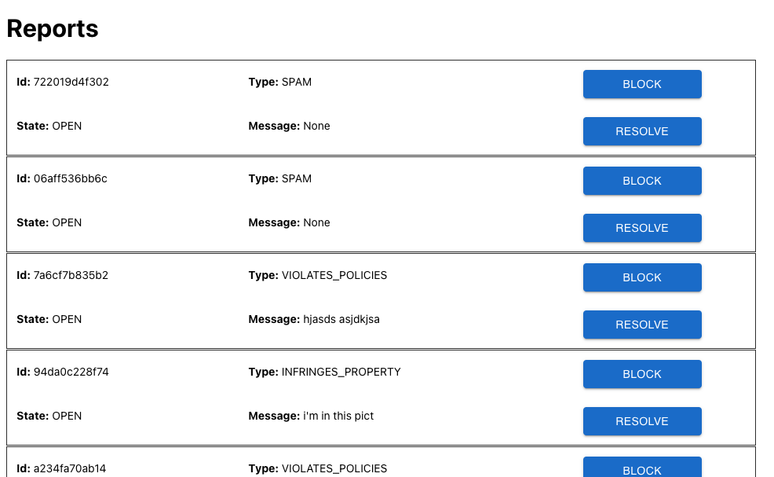

# Introduction

This is the frontend of the `Spam Management Service (SMS)`. For more information about the whole service, please refer to the [backend](https://github.com/marcosuma/spam-management-service-backend) project.

The frontend component of SRMS has been written using **Javascript** and **React**.
The UI is fairly simple and it follows the guidelines provided in the [official documentation](https://github.com/morkro/coding-challenge).

# Project structure

The project is small and has very few dependencies (besides react of course).

The main React component is `App.js` which contains the homepage structure. That is followed by `Reports.js` which represents the entire table. Each report is made of `ReportItem.js` (rows) and the `EntryButton.js` is the react component that is used to show the "Block" and "Resolve" buttons.

# How to run

This project can simply be launched with `npm start` (doing that will run the project in development mode).
Open [http://localhost:3000](http://localhost:3000) to view it in your browser.

## How to test

You can run `npm test` which launches the test runner in the interactive watch mode.
**Note:** The frontend test acts like an integration test therefore you need to have a running backend endpoint on your localhost to let the test succeed.

# Potential improvements

These improvements are to be meant for real case scenarios.

- `Internationalisation`: text is written in English and hardcoded in the react components. In real case scenarios where we have customers from all over the world we should use i18n framework to support multiple languages
- `Search functionality`: a nice add-on feature for this UI would be the possibility of searching across the different reports.
- `Pagination`: when there are too many results, pagination must be implemented. For the sake of this task I skipped pagination but in real cases it would be necessary considering that reports could grow infinitely.
- `Use TypeScript` (Requirement was clearly expressed by the recruiter to be Javascript): I explained this reason in the `README.md` file of the [backend](https://github.com/marcosuma/spam-management-service-backend) project.
- `Testing`: Similar to the [backend](https://github.com/marcosuma/spam-management-service-backend) project I added a basic test coverage to highlight the importance of testing. For production situations we should add more tests, including UI screenshot testings.
